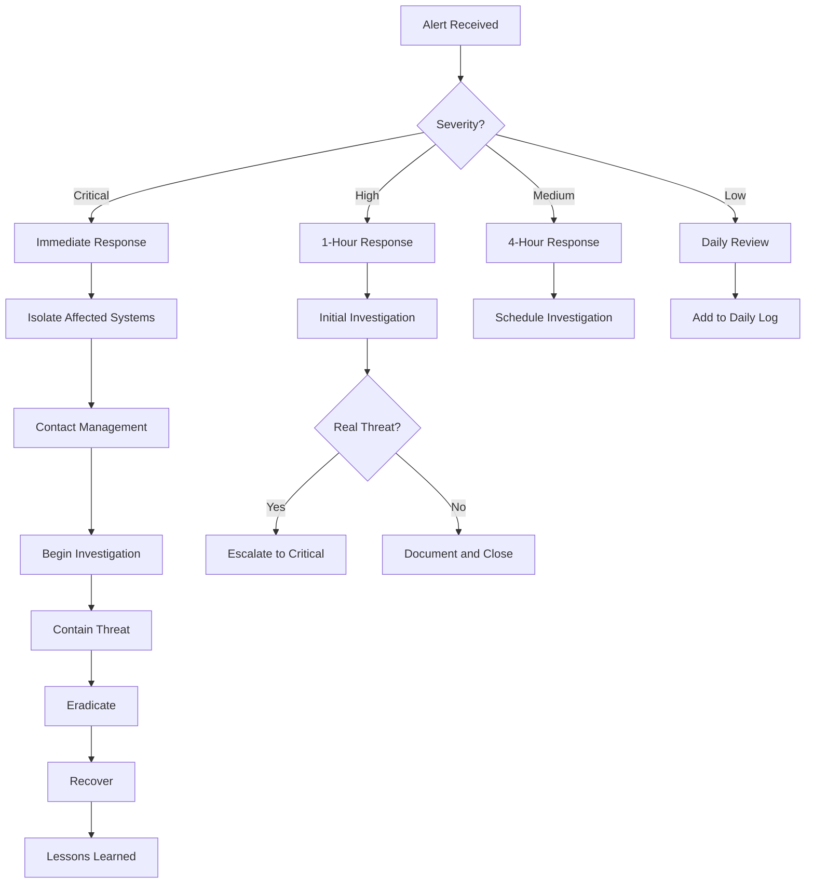
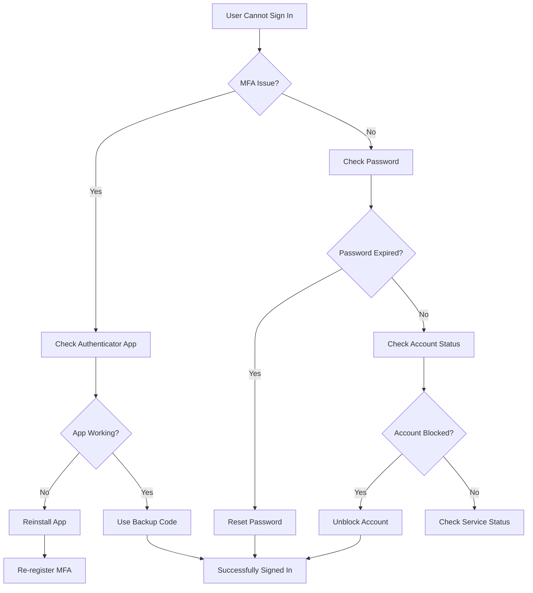

# Technical Implementation Training Guide
## C6Med Security Controls Implementation

---

## Executive Summary

This comprehensive training guide provides C6Med's key personnel with the practical knowledge and hands-on skills needed to implement and manage security controls across the organization. The training covers essential security technologies, processes, and procedures aligned with NIST Cybersecurity Framework requirements while maintaining focus on the Microsoft 365 ecosystem and BYOD environment.

**Training Duration:** 4-6 hours (can be delivered in modules)
**Target Audience:** 5-6 key employees responsible for IT/security implementation
**Technical Level:** Beginner to Intermediate (accommodates varying skill levels)
**Delivery Format:** Instructor-led with hands-on exercises

---

## Table of Contents

1. [Training Overview and Objectives](#training-overview-and-objectives)
2. [Module 1: Device Management](#module-1-device-management)
3. [Module 2: Security Tool Configuration](#module-2-security-tool-configuration)
4. [Module 3: User Access Management](#module-3-user-access-management)
5. [Module 4: Multi-Factor Authentication](#module-4-multi-factor-authentication)
6. [Module 5: Password Management](#module-5-password-management)
7. [Module 6: Security Monitoring](#module-6-security-monitoring)
8. [Module 7: Patch Management](#module-7-patch-management)
9. [Module 8: Backup Verification](#module-8-backup-verification)

---

## Training Overview and Objectives

### Learning Objectives

Upon completion of this training, participants will be able to:

1. **Configure and manage** device security controls in a BYOD environment
2. **Implement and maintain** Microsoft 365 security features effectively
3. **Manage user access** following least privilege principles
4. **Deploy and support** multi-factor authentication across all systems
5. **Administer** enterprise password management solutions
6. **Monitor** security alerts and respond appropriately
7. **Ensure** timely patch management across all devices
8. **Verify and test** backup systems regularly

### Training Approach

- **Hands-On Learning:** 70% practical exercises, 30% instruction
- **Real-World Scenarios:** Based on C6Med's actual environment
- **Progressive Difficulty:** Start with basics, build to advanced topics
- **Documentation Focus:** Create reference materials during training

### Prerequisites

- Basic computer skills (Windows or Mac)
- Access to C6Med Microsoft 365 admin portal
- Administrator access to a test device
- Note-taking materials

---

## Module 1: Device Management
**Duration:** 60 minutes | **NIST CSF:** PR.AC-1, PR.DS-1

### Learning Objectives
- Understand device management options and trade-offs
- Configure device compliance policies
- Enroll devices in management systems
- Monitor device compliance status

### Section 1.1: Device Management Options

#### Option A: Microsoft Intune (Recommended for M365 Environment)

**Advantages:**
- Integrated with Microsoft 365 licenses
- Seamless with existing infrastructure
- No additional cost for basic features
- Strong Windows and mobile support

**Setup Process:**
1. Navigate to endpoint.microsoft.com
2. Sign in with global admin credentials
3. Go to Devices > Enrollment
4. Configure enrollment restrictions

**Key Configuration Steps:**

```powershell
# PowerShell commands for Intune setup
Connect-MSGraph
Update-MSGraphEnvironment -SchemaVersion "Beta"

# Create device compliance policy
New-IntuneDeviceCompliancePolicy -DisplayName "C6Med Standard Compliance" `
    -RequireDeviceEncryption $true `
    -RequirePasswordToUnlock $true `
    -MinimumPasswordLength 8
```

#### Option B: Rippling (If Selected for HR/IT Integration)

**Advantages:**
- Combined HR and IT management
- Automated onboarding/offboarding
- App provisioning included
- Single dashboard for all operations

**Setup Process:**
1. Access Rippling admin portal
2. Navigate to IT Management
3. Configure device policies
4. Set enrollment requirements

**Configuration Checklist:**
- [ ] Enable device encryption requirement
- [ ] Set password complexity rules
- [ ] Configure screen lock timeout (5 minutes)
- [ ] Enable remote wipe capability
- [ ] Set compliance grace period (24 hours)

#### Option C: Manual Management (Fallback Approach)

**When to Use:**
- Temporary solution during transition
- Specific devices that cannot be enrolled
- Contractor or guest devices

**Manual Management Checklist:**

| Control | Windows | Mac | Verification Method |
|---------|---------|-----|-------------------|
| BitLocker/FileVault | Settings > Update & Security > Device Encryption | System Preferences > Security & Privacy > FileVault | Screenshot of enabled status |
| Windows Defender/XProtect | Windows Security Center | System Preferences > Security & Privacy | Run test scan |
| Automatic Updates | Settings > Update & Security | System Preferences > Software Update | Check last update date |
| Screen Lock | Settings > Accounts > Sign-in Options | System Preferences > Security & Privacy | Test lock after 5 minutes |
| Firewall | Windows Security > Firewall | System Preferences > Security & Privacy > Firewall | Verify "On" status |

### Section 1.2: Hands-On Exercise - Device Enrollment

**Exercise 1.1: Enroll a Windows Device in Intune**

**Scenario:** New employee Sarah joins C6Med and needs her personal laptop configured for work.

**Steps:**
1. On Sarah's Windows device, go to Settings > Accounts > Access work or school
2. Click "Connect"
3. Enter C6Med email address
4. Complete MFA challenge
5. Accept terms and conditions
6. Wait for policies to apply (5-10 minutes)

**Validation:**
- Check enrollment status in Intune portal
- Verify compliance policies applied
- Confirm device appears in inventory

**Common Issues and Solutions:**

| Issue | Solution |
|-------|----------|
| Enrollment fails with error 80180014 | Clear browser cache, try different browser |
| Policies not applying | Force sync: Settings > Accounts > Access work or school > Info > Sync |
| Device shows non-compliant | Review specific compliance issues in portal, address each item |

### Section 1.3: Compliance Monitoring

**Daily Monitoring Tasks:**
1. Check Intune/Rippling dashboard for non-compliant devices
2. Review new device enrollments
3. Verify high-risk users' device status

**Weekly Tasks:**
1. Generate compliance report
2. Follow up on non-compliant devices
3. Review and update policies as needed

**Monitoring Dashboard Creation:**

```powershell
# Create custom compliance report
Get-IntuneManagedDevice |
    Select-Object DeviceName, UserPrincipalName, ComplianceState, LastSyncDateTime |
    Export-Csv "C:\Reports\WeeklyCompliance.csv"
```

---

## Module 2: Security Tool Configuration
**Duration:** 90 minutes | **NIST CSF:** PR.AC-4, PR.DS-5, PR.PT-3

### Learning Objectives
- Configure Microsoft 365 security features
- Implement SharePoint security controls
- Set up Dropbox business security
- Configure endpoint protection

### Section 2.1: Microsoft 365 Security Configuration

#### Security & Compliance Center Setup

**Access:** https://security.microsoft.com

**Essential Configurations:**

1. **Enable Security Defaults**
   - Navigate to Azure AD > Properties > Manage Security Defaults
   - Toggle "Enable Security Defaults" to Yes
   - Enforces MFA for all users
   - Blocks legacy authentication

2. **Configure Data Loss Prevention (DLP)**
   ```
   Step-by-step:
   1. Security Center > Solutions > Data Loss Prevention
   2. Create new DLP policy
   3. Name: "C6Med Sensitive Data Protection"
   4. Locations: Exchange, SharePoint, OneDrive, Teams
   5. Add condition: Content contains > Sensitive info types
   6. Select: SSN, Credit Card, Health Records
   7. Actions: Block external sharing, notify user
   8. Test mode first (7 days), then enforce
   ```

3. **Enable Advanced Threat Protection**
   - Defender for Office 365 > Policies
   - Configure Safe Attachments:
     * Action: Dynamic Delivery
     * Redirect to: security@c6med.com
   - Configure Safe Links:
     * Apply to emails and Office documents
     * Track user clicks
     * Don't rewrite internal URLs

#### SharePoint Security Configuration

**Permission Management Best Practices:**

1. **Site Collection Setup**
   ```
   Site Settings > Site Permissions
   - Remove "Everyone except external users"
   - Create security groups:
     * C6Med-Executives (Full Control)
     * C6Med-Staff (Edit)
     * C6Med-Contractors (Read Only)
   ```

2. **External Sharing Controls**
   - SharePoint Admin Center > Policies > Sharing
   - Set to "New and existing guests"
   - Require sign-in for guest access
   - Set link expiration to 30 days
   - Enable audit logging for all activities

3. **Sensitivity Labels Configuration**
   ```powershell
   # Create sensitivity labels
   New-Label -DisplayName "C6Med Confidential" `
             -Tooltip "Confidential C6Med data" `
             -EncryptionEnabled $true `
             -ContentEncryptionType Template
   ```

### Section 2.2: Dropbox Business Security

**Security Configuration Checklist:**

- [ ] Enable two-step verification requirement
- [ ] Set session length to 8 hours
- [ ] Enable device approvals
- [ ] Configure sharing permissions (team only)
- [ ] Enable ransomware detection
- [ ] Set file recovery window (180 days)
- [ ] Configure audit log retention
- [ ] Enable suspicious activity monitoring

**Step-by-Step Configuration:**

1. **Access Admin Console**
   - Sign in to Dropbox Business admin console
   - Navigate to Admin Console > Settings

2. **Security Settings**
   ```
   Security Tab Configuration:
   - Two-step verification: Required for all users
   - Session management: Web = 8 hours, Desktop = Never
   - Device approvals: Enabled with email notification
   - Remote wipe: Enabled for lost devices
   ```

3. **Sharing Settings**
   ```
   Sharing Tab Configuration:
   - Default sharing: Team members only
   - Shared links: Password required
   - Link expiration: 30 days default
   - Download disabled for viewers
   ```

### Section 2.3: Endpoint Protection Configuration

#### Windows Defender Configuration

**PowerShell Configuration Script:**

```powershell
# Enhanced Windows Defender Configuration
# Run as Administrator

# Enable Real-time Protection
Set-MpPreference -DisableRealtimeMonitoring $false

# Enable Cloud Protection
Set-MpPreference -MAPSReporting Advanced
Set-MpPreference -SubmitSamplesConsent SendAllSamples

# Configure Scanning
Set-MpPreference -ScanScheduleDay Everyday
Set-MpPreference -ScanScheduleTime 12:00
Set-MpPreference -CheckForSignaturesBeforeRunningScan $true

# Enable Network Protection
Set-MpPreference -EnableNetworkProtection Enabled

# Configure Exclusions (if needed for specific apps)
# Add-MpPreference -ExclusionPath "C:\BusinessApp\Temp"

# Enable Controlled Folder Access
Set-MpPreference -EnableControlledFolderAccess Enabled

# Verify Configuration
Get-MpPreference | Select-Object DisableRealtimeMonitoring,
                                 MAPSReporting,
                                 EnableNetworkProtection
```

#### macOS Security Configuration

**Terminal Commands for Mac Security:**

```bash
# Enable Firewall
sudo /usr/libexec/ApplicationFirewall/socketfilterfw --setglobalstate on

# Enable Stealth Mode
sudo /usr/libexec/ApplicationFirewall/socketfilterfw --setstealthmode on

# Enable FileVault
sudo fdesetup enable

# Enable Gatekeeper
sudo spctl --master-enable

# Check Security Status
sudo /usr/libexec/ApplicationFirewall/socketfilterfw --getglobalstate
fdesetup status
spctl --status
```

### Section 2.4: Hands-On Exercise - Security Tool Configuration

**Exercise 2.1: Configure SharePoint Site Security**

**Scenario:** Create a new SharePoint site for client contracts with appropriate security.

**Steps:**
1. Create new SharePoint site called "Client Contracts"
2. Configure permissions:
   - Remove inherited permissions
   - Add C6Med-Executives group (Full Control)
   - Add C6Med-Legal group (Edit)
   - Add C6Med-Staff group (Read)
3. Enable Information Rights Management
4. Apply "C6Med Confidential" sensitivity label
5. Configure audit settings
6. Test access with test user account

**Validation Checklist:**
- [ ] External users cannot access
- [ ] Audit logs capture all downloads
- [ ] Sensitivity label prevents copying
- [ ] Permissions work as expected

---

## Module 3: User Access Management
**Duration:** 60 minutes | **NIST CSF:** PR.AC-1, PR.AC-4, PR.AC-7

### Learning Objectives
- Implement role-based access control
- Configure provisioning/de-provisioning procedures
- Perform access reviews
- Apply least privilege principles

### Section 3.1: Role-Based Access Control (RBAC)

#### Defining Roles for C6Med

**Standard Role Matrix:**

| Role | M365 Permissions | SharePoint | Dropbox | Administrative Rights |
|------|-----------------|------------|---------|---------------------|
| Executive | E3 License, Full Mailbox | Site Collection Admin | Team Admin | Global Reader |
| Clinical Staff | E3 License, Standard | Edit on Clinical Sites | Editor | None |
| Admin Staff | E1 License, Standard | Edit on Admin Sites | Editor | User Administrator |
| Contractor | Guest Account | Read Only Specific | Viewer | None |
| IT Admin | E3 License, Full | Global SharePoint Admin | Team Admin | Global Administrator |

**PowerShell Script for Role Assignment:**

```powershell
# C6Med Role Assignment Script
# Define role groups
$Roles = @{
    "Executives" = @{
        License = "SPE_E3"
        SharePointRole = "Full Control"
        AdminRole = "Global Reader"
    }
    "ClinicalStaff" = @{
        License = "SPE_E3"
        SharePointRole = "Edit"
        AdminRole = $null
    }
    "AdminStaff" = @{
        License = "SPE_E1"
        SharePointRole = "Edit"
        AdminRole = "User Administrator"
    }
}

# Function to assign role
function Assign-C6MedRole {
    param(
        [string]$UserPrincipalName,
        [string]$Role
    )

    $RoleConfig = $Roles[$Role]

    # Assign license
    Set-MsolUserLicense -UserPrincipalName $UserPrincipalName `
                        -AddLicenses "c6med:$($RoleConfig.License)"

    # Assign admin role if applicable
    if ($RoleConfig.AdminRole) {
        Add-MsolRoleMember -RoleName $RoleConfig.AdminRole `
                          -RoleMemberEmailAddress $UserPrincipalName
    }

    Write-Host "Role $Role assigned to $UserPrincipalName"
}
```

### Section 3.2: User Provisioning Procedures

#### New User Onboarding Checklist

**Pre-Provisioning:**
- [ ] Receive approved request from management
- [ ] Verify user role and required access
- [ ] Check license availability

**Account Creation:**

1. **Create Microsoft 365 Account**
   ```
   Step-by-step:
   1. Admin Center > Users > Active users > Add user
   2. Enter user details:
      - First name, Last name
      - Display name: [FirstName] [LastName]
      - Username: firstname.lastname@c6med.com
   3. Select "Auto-generate password"
   4. Check "Send password in email"
   5. Assign appropriate license
   6. Add to security groups
   ```

2. **Configure Additional Access**
   ```powershell
   # Automated provisioning script
   $NewUser = "john.doe@c6med.com"
   $Role = "ClinicalStaff"

   # Create mailbox
   Enable-Mailbox -Identity $NewUser

   # Add to distribution groups
   Add-DistributionGroupMember -Identity "AllStaff" -Member $NewUser
   Add-DistributionGroupMember -Identity "ClinicalTeam" -Member $NewUser

   # Set mailbox policies
   Set-CASMailbox -Identity $NewUser -OwaEnabled $true `
                  -PopEnabled $false -ImapEnabled $false

   # Configure OneDrive
   Request-SPOPersonalSite -UserEmails $NewUser
   ```

3. **Send Welcome Email Template**
   ```
   Subject: Welcome to C6Med - Account Setup Instructions

   Dear [Name],

   Your C6Med account has been created. Please follow these steps:

   1. Sign in at https://portal.office.com
   2. Username: [username]
   3. Temporary password: [sent separately]
   4. You'll be prompted to change your password
   5. Set up MFA at https://aka.ms/mfasetup
   6. Install Microsoft Authenticator on your phone

   Required Training:
   - Security Awareness: [link]
   - M365 Basics: [link]

   IT Support: itsupport@c6med.com
   ```

### Section 3.3: User De-Provisioning Procedures

#### Termination Checklist

**Immediate Actions (Within 1 Hour):**

```powershell
# Emergency Termination Script
$TermUser = "departed.user@c6med.com"

# Block sign-in immediately
Set-MsolUser -UserPrincipalName $TermUser -BlockCredential $true

# Revoke all sessions
Revoke-AzureADUserAllRefreshToken -ObjectId (Get-AzureADUser -ObjectId $TermUser).ObjectId

# Convert to shared mailbox (preserves data)
Set-Mailbox -Identity $TermUser -Type Shared

# Remove from all groups
Get-DistributionGroup | Remove-DistributionGroupMember -Member $TermUser -Confirm:$false

# Forward email to manager
Set-Mailbox -Identity $TermUser -ForwardingAddress "manager@c6med.com"

Write-Host "User $TermUser has been disabled"
```

**Within 24 Hours:**
- [ ] Remove from SharePoint permissions
- [ ] Remove from Dropbox
- [ ] Wipe company data from personal devices
- [ ] Document access removal in log

**Within 7 Days:**
- [ ] Archive OneDrive content
- [ ] Archive mailbox to PST
- [ ] Remove licenses
- [ ] Delete account after 30 days

### Section 3.4: Access Reviews

#### Quarterly Access Review Process

**Review Template:**

```excel
User Access Review - Q[X] 2024
================================
User Name | Department | M365 License | SharePoint Sites | Dropbox Access | Last Login | Manager Approval
----------|------------|--------------|------------------|----------------|------------|------------------
John Doe  | Clinical   | E3           | Clinical, Admin  | Editor         | 10/1/2024  | [Pending]
Jane Smith| Admin      | E1           | Admin            | Viewer         | 10/5/2024  | [Approved]
```

**PowerShell Access Review Script:**

```powershell
# Generate Access Review Report
$Users = Get-MsolUser -All
$Report = @()

foreach ($User in $Users) {
    # Get user details
    $UserReport = New-Object PSObject -Property @{
        DisplayName = $User.DisplayName
        UPN = $User.UserPrincipalName
        Licensed = ($User.Licenses -ne $null)
        LastLogin = (Get-MailboxStatistics $User.UserPrincipalName).LastLogonTime
        Groups = (Get-MsolUserMembership -UserPrincipalName $User.UserPrincipalName).Name -join ", "
        AdminRoles = (Get-MsolUserRole -UserPrincipalName $User.UserPrincipalName).Name -join ", "
        Status = $User.BlockCredential
    }
    $Report += $UserReport
}

$Report | Export-Csv "C:\AccessReviews\Q4_2024_Review.csv" -NoTypeInformation
```

### Section 3.5: Hands-On Exercise - User Lifecycle Management

**Exercise 3.1: Complete User Onboarding**

**Scenario:** New clinical staff member Maria Rodriguez joins C6Med.

**Tasks:**
1. Create user account (maria.rodriguez@c6med.com)
2. Assign E3 license
3. Add to ClinicalStaff security group
4. Configure SharePoint access (Clinical Sites - Edit)
5. Set up Dropbox access (Editor role)
6. Send welcome email
7. Verify MFA enrollment after first login

**Validation:**
- [ ] User can sign in successfully
- [ ] MFA prompts on second login
- [ ] Can access Clinical SharePoint site
- [ ] Can edit files in Dropbox
- [ ] Appears in audit logs

---

## Module 4: Multi-Factor Authentication
**Duration:** 45 minutes | **NIST CSF:** PR.AC-7, PR.AC-1

### Learning Objectives
- Enable and configure MFA across all platforms
- Support user enrollment
- Troubleshoot common MFA issues
- Manage backup authentication methods

### Section 4.1: Microsoft 365 MFA Configuration

#### Enabling MFA for All Users

**Method 1: Security Defaults (Recommended for Simplicity)**

```
Azure AD Admin Center > Properties > Manage Security Defaults
Toggle: Enable Security Defaults = Yes

What this enables:
✓ MFA for all users
✓ MFA for administrators (always)
✓ Blocks legacy authentication
✓ Protects privileged activities
```

**Method 2: Conditional Access (Advanced Control)**

```powershell
# Create Conditional Access Policy for MFA
New-AzureADMSConditionalAccessPolicy -DisplayName "Require MFA for All Users" `
    -State "Enabled" `
    -Conditions @{
        Users = @{
            IncludeUsers = "All"
            ExcludeUsers = @("emergency@c6med.com")
        }
        Applications = @{
            IncludeApplications = "All"
        }
    } `
    -GrantControls @{
        RequireMfa = $true
    }
```

#### MFA Methods Configuration

**Available Methods Priority:**

| Method | Security Level | User Convenience | Recommended For |
|--------|---------------|------------------|----------------|
| Authenticator App | High | High | All users (primary) |
| SMS | Medium | High | Backup only |
| Voice Call | Medium | Medium | Accessibility needs |
| Hardware Token | Highest | Low | Executives only |
| Email | Low | High | Not recommended |

**Configure Authentication Methods:**

```
Azure AD > Security > Authentication methods > Policies

Microsoft Authenticator settings:
- Enable for: All users
- Require number matching: Yes
- Show location: Yes
- Show app name: Yes

SMS settings:
- Enable for: All users
- Use for: Authentication and SSPR

Voice call:
- Enable for: Specific users only
```

### Section 4.2: User Enrollment Process

#### Step-by-Step User Enrollment Guide

**For End Users:**

1. **Initial Setup Email Template**
   ```
   Subject: Action Required: Set Up Multi-Factor Authentication

   You must set up MFA within 24 hours. Follow these steps:

   1. Go to https://aka.ms/mfasetup
   2. Sign in with your C6Med credentials
   3. Download Microsoft Authenticator:
      - iPhone: App Store
      - Android: Google Play
   4. Click "Add Account" in the app
   5. Select "Work or school account"
   6. Scan the QR code on your computer screen
   7. Enter the verification code from the app
   8. Add a backup phone number
   9. Test your setup

   Need help? Contact: itsupport@c6med.com
   Video guide: [link to training video]
   ```

2. **Administrator Enrollment Support Script**

```powershell
# Check user MFA status
function Get-MFAStatus {
    param([string]$UserPrincipalName)

    $MFAData = Get-MsolUser -UserPrincipalName $UserPrincipalName |
        Select-Object DisplayName,
                      UserPrincipalName,
                      @{N="MFA Status"; E={$_.StrongAuthenticationRequirements.State}},
                      @{N="Methods"; E={$_.StrongAuthenticationMethods.MethodType}}

    return $MFAData
}

# Force MFA re-registration
function Reset-MFA {
    param([string]$UserPrincipalName)

    Set-MsolUser -UserPrincipalName $UserPrincipalName `
                 -StrongAuthenticationMethods @()

    Write-Host "MFA reset for $UserPrincipalName. User must re-enroll."
}
```

### Section 4.3: Dropbox MFA Configuration

**Enabling Dropbox Two-Step Verification:**

1. **Admin Console Configuration**
   ```
   Admin Console > Settings > Security
   - Two-step verification: Required for all team members
   - Grace period: 7 days
   - Backup methods: Allow SMS and backup codes
   ```

2. **User Enrollment Process**
   ```
   User Steps:
   1. Sign in to Dropbox
   2. Click avatar > Settings
   3. Security tab > Two-step verification
   4. Turn on > Enter password
   5. Choose method (app or SMS)
   6. Complete verification
   7. Save backup codes securely
   ```

### Section 4.4: MFA Troubleshooting Guide

#### Common Issues and Solutions

| Issue | Symptoms | Solution |
|-------|----------|----------|
| Lost Phone | Can't generate codes | Use backup codes, then reset MFA |
| New Phone | Codes don't work | Re-register device, update phone number |
| App Not Working | No push notifications | Check internet, reinstall app, re-register |
| Travel Issues | International roaming | Use offline codes, configure before travel |
| Account Locked | Too many failed attempts | Admin reset, wait 15 minutes |

**Emergency Access Procedures:**

```powershell
# Create break-glass account
$EmergencyAccount = "emergency.admin@c6med.com"

# Configure exclusions
# Exclude from MFA requirement but monitor closely
Set-MsolUser -UserPrincipalName $EmergencyAccount `
             -StrongAuthenticationRequirements @()

# Set up alerting for break-glass account use
$Alert = New-AzureADMSAlertDefinition -DisplayName "Emergency Account Used" `
    -Severity "High" `
    -Category "Security" `
    -Description "Break-glass account was accessed"
```

### Section 4.5: Hands-On Exercise - MFA Deployment

**Exercise 4.1: Complete MFA Rollout**

**Scenario:** Deploy MFA to a test group before company-wide rollout.

**Steps:**
1. Create test group "MFA-Pilot" with 2 users
2. Enable MFA for test group only
3. Guide users through enrollment
4. Test various scenarios:
   - Normal sign-in
   - New device sign-in
   - Password reset with MFA
   - App re-registration
5. Document issues and solutions
6. Prepare for company-wide deployment

**Success Criteria:**
- [ ] All test users enrolled successfully
- [ ] Users can sign in with MFA
- [ ] Backup methods configured
- [ ] Documentation updated
- [ ] Help desk prepared

---

## Module 5: Password Management
**Duration:** 45 minutes | **NIST CSF:** PR.AC-1, IA-5

### Learning Objectives
- Deploy enterprise password manager
- Configure password policies
- Manage shared credentials securely
- Train users on password best practices

### Section 5.1: Password Manager Selection and Deployment

#### Recommended Solution: 1Password Business

**Why 1Password for C6Med:**
- HIPAA compliant
- Strong business features
- Good SharePoint/M365 integration
- Reasonable pricing for small teams
- Excellent mobile apps

**Alternative: Bitwarden Business**
- Open source option
- More cost-effective
- Slightly less polished UI
- Good security fundamentals

#### 1Password Deployment Process

**Initial Setup:**

1. **Account Creation**
   ```
   1. Go to 1password.com/business
   2. Start free trial
   3. Create account with admin@c6med.com
   4. Set up billing (after trial)
   5. Configure team name: C6Med
   ```

2. **Team Configuration**
   ```
   Admin Panel Configuration:
   - Provisioning: SCIM with Azure AD
   - Authentication: SSO with Microsoft 365
   - Policies:
     * Master password minimum: 16 characters
     * Two-factor: Required
     * Session timeout: 10 minutes idle
     * Clipboard clearing: 90 seconds
   ```

3. **Vault Structure Setup**
   ```
   Recommended Vault Organization:

   📁 Shared Vaults:
      📁 IT Systems (IT admins only)
         - Admin credentials
         - Service accounts
         - API keys
      📁 Client Accounts (All staff)
         - Client portal logins
         - Shared email accounts
      📁 Software Licenses (Managers)
         - License keys
         - Activation codes
      📁 Finance (Finance + Executive)
         - Banking credentials
         - Credit card info
      📁 Emergency Access (Executives)
         - Break-glass accounts
         - Recovery codes
   ```

### Section 5.2: Password Policy Configuration

#### Microsoft 365 Password Policy

```powershell
# Configure M365 Password Policy
# Connect to Azure AD
Connect-AzureAD

# Set password policy
$PasswordPolicy = New-Object -TypeName Microsoft.Open.AzureAD.Model.PasswordPolicy
$PasswordPolicy.ValidityPeriod = 90
$PasswordPolicy.NotificationDays = 14
$PasswordPolicy.MinPasswordLength = 12
$PasswordPolicy.RequireUppercase = $true
$PasswordPolicy.RequireLowercase = $true
$PasswordPolicy.RequireNumbers = $true
$PasswordPolicy.RequireSpecialCharacters = $true
$PasswordPolicy.DisallowedList = @("C6Med2024", "Password123", "Welcome123")

# Apply policy
Set-AzureADPasswordPolicy -Policy $PasswordPolicy

# Prevent password expiration for service accounts
Set-MsolUser -UserPrincipalName "scanner@c6med.com" `
             -PasswordNeverExpires $true
```

#### Password Requirements Matrix

| System | Min Length | Complexity | Expiration | MFA Required |
|--------|-----------|------------|------------|--------------|
| Microsoft 365 | 12 | Upper+Lower+Number+Special | 90 days | Yes |
| 1Password Master | 16 | Passphrase recommended | Never | Yes |
| Local Device | 8 | Complex | 180 days | No |
| Shared Accounts | 20 | Random generated | 30 days | N/A |

### Section 5.3: Shared Credential Management

#### Secure Sharing Procedures

**Creating Shared Credentials:**

```javascript
// Password Generation Script (for reference)
function generateSecurePassword(length = 20) {
    const uppercase = 'ABCDEFGHIJKLMNOPQRSTUVWXYZ';
    const lowercase = 'abcdefghijklmnopqrstuvwxyz';
    const numbers = '0123456789';
    const symbols = '!@#$%^&*()_+-=[]{}|;:,.<>?';
    const all = uppercase + lowercase + numbers + symbols;

    let password = '';
    // Ensure at least one of each type
    password += uppercase[Math.floor(Math.random() * uppercase.length)];
    password += lowercase[Math.floor(Math.random() * lowercase.length)];
    password += numbers[Math.floor(Math.random() * numbers.length)];
    password += symbols[Math.floor(Math.random() * symbols.length)];

    // Fill remaining length
    for (let i = 4; i < length; i++) {
        password += all[Math.floor(Math.random() * all.length)];
    }

    // Shuffle password
    return password.split('').sort(() => 0.5 - Math.random()).join('');
}
```

**Shared Account Best Practices:**

1. **Never Share Personal Passwords**
   - Each user has unique credentials
   - Shared accounts only for systems that require it

2. **Audit Shared Access**
   ```powershell
   # Monthly audit script
   Get-1PasswordVaultAccess -Vault "Client Accounts" |
       Where-Object {$_.LastAccessed -gt (Get-Date).AddDays(-30)} |
       Export-Csv "SharedPasswordAudit.csv"
   ```

3. **Rotation Schedule**
   - Quarterly: All shared accounts
   - Monthly: High-privilege accounts
   - Immediately: After employee departure

### Section 5.4: User Training and Adoption

#### Password Manager Training Guide

**Quick Start Guide for Users:**

```markdown
# 1Password Quick Start Guide

## Installation
1. Check email for 1Password invitation
2. Click "Join Team"
3. Create master password (use passphrase!)
   Example: correct-horse-battery-staple-c6med
4. Download apps:
   - Desktop: 1password.com/downloads
   - Mobile: App Store / Google Play
5. Install browser extension

## Daily Use
- Cmd/Ctrl + \ : Fill passwords
- Cmd/Ctrl + Shift + X : Show 1Password mini
- Right-click > 1Password > Fill

## Saving Passwords
1. Let 1Password detect login
2. Click "Save in 1Password"
3. Choose appropriate vault
4. Add tags for organization

## Generating Passwords
1. Click password field
2. Click 1Password icon
3. Use suggested password
4. It's automatically saved!
```

**Training Video Script Outline:**
1. Introduction (30 seconds)
2. Why password managers matter (1 minute)
3. Installation walkthrough (2 minutes)
4. Creating master password (1 minute)
5. Saving first password (1 minute)
6. Using password generator (1 minute)
7. Accessing shared vaults (1 minute)
8. Mobile app setup (1 minute)
9. Common issues (1 minute)
10. Getting help (30 seconds)

### Section 5.5: Hands-On Exercise - Password Manager Deployment

**Exercise 5.1: Complete Team Onboarding**

**Scenario:** Onboard 3 team members to 1Password and migrate their passwords.

**Tasks:**
1. Send invitations to team members
2. Guide through master password creation
3. Install on all devices:
   - Windows/Mac computer
   - Mobile phone
   - Browser extension
4. Migrate existing passwords:
   - Export from browser
   - Import to 1Password
   - Verify and organize
5. Create shared vault for team
6. Add one shared credential
7. Test access and permissions

**Validation Checklist:**
- [ ] All users logged in successfully
- [ ] Browser extension working
- [ ] Mobile app configured
- [ ] Can access shared vault
- [ ] Old passwords deleted from browser
- [ ] MFA enabled on 1Password

---

## Module 6: Security Monitoring
**Duration:** 60 minutes | **NIST CSF:** DE.AE-1, DE.CM-1, DE.CM-7

### Learning Objectives
- Configure security monitoring dashboards
- Understand alert types and priorities
- Implement response procedures
- Create monitoring schedules

### Section 6.1: Microsoft 365 Security Monitoring

#### Security & Compliance Center Dashboard

**Key Monitoring Areas:**

1. **Threat Dashboard Configuration**
   ```
   Navigate to: security.microsoft.com

   Pin these cards to dashboard:
   - Threat Protection Status
   - Malware Trends
   - Users at Risk
   - Suspicious Activities
   - DLP Policy Matches
   - Compliance Score
   ```

2. **Alert Policies Setup**
   ```powershell
   # Create custom alert policies
   New-ActivityAlert -Name "External Sharing Alert" `
       -Operation "SharePointFileOperation" `
       -Conditions @{Users="All"; Operations="FileDownloaded"} `
       -NotifyUsers "security@c6med.com" `
       -Severity "Medium"

   New-ActivityAlert -Name "Mass Download Alert" `
       -Operation "FileDownloaded" `
       -Threshold 50 `
       -TimeWindow 60 `
       -NotifyUsers "security@c6med.com" `
       -Severity "High"

   New-ActivityAlert -Name "Admin Role Change" `
       -Operation "Add member to role" `
       -NotifyUsers "security@c6med.com" `
       -Severity "High"
   ```

#### Alert Priority Matrix

| Priority | Response Time | Examples | Actions |
|----------|--------------|----------|---------|
| Critical | Immediate (15 min) | Ransomware detected, Account compromise | Isolate, Call management |
| High | 1 hour | Mass deletion, Privilege escalation | Investigate, Suspend account |
| Medium | 4 hours | Unusual sign-in, DLP violation | Review, Contact user |
| Low | 24 hours | Failed sign-ins, Policy violation | Document, Monitor |

### Section 6.2: SharePoint and OneDrive Monitoring

#### Audit Log Configuration

**Enable Comprehensive Auditing:**

```powershell
# Enable unified audit log
Set-AdminAuditLogConfig -UnifiedAuditLogIngestionEnabled $true

# Configure SharePoint audit settings
Set-SPOTenant -EnableAutoNewsDigest $false `
               -NotificationsInSharePointEnabled $true `
               -SpecialCharactersStateInFileFolderNames "Allowed"

# Create audit log search
Search-UnifiedAuditLog -StartDate (Get-Date).AddDays(-7) `
                      -EndDate (Get-Date) `
                      -Operations "FileDeleted,FileDeletedFirstStageRecycleBin" `
                      -ResultSize 5000 |
    Export-Csv "WeeklyDeletions.csv"
```

**Key Events to Monitor:**

```markdown
## Daily Review Checklist

### User Activities
- [ ] Unusual sign-in locations
- [ ] After-hours access patterns
- [ ] Failed authentication attempts
- [ ] New device registrations

### File Operations
- [ ] Mass downloads (>20 files)
- [ ] External sharing events
- [ ] Sensitive file access
- [ ] Bulk deletions

### Administrative Changes
- [ ] Permission modifications
- [ ] Group membership changes
- [ ] Policy updates
- [ ] Security setting changes
```

### Section 6.3: Automated Monitoring Scripts

#### Daily Security Check Script

```powershell
# C6Med Daily Security Monitoring Script
# Schedule to run every morning at 8 AM

function Run-DailySecurityCheck {
    $Today = Get-Date
    $Yesterday = $Today.AddDays(-1)
    $ReportPath = "C:\SecurityReports\DailyReport_$($Today.ToString('yyyyMMdd')).html"

    # Initialize HTML report
    $HTMLReport = @"
    <html>
    <head>
        <style>
            body { font-family: Arial, sans-serif; }
            table { border-collapse: collapse; width: 100%; }
            th, td { border: 1px solid #ddd; padding: 8px; text-align: left; }
            th { background-color: #4CAF50; color: white; }
            .critical { background-color: #ff0000; color: white; }
            .warning { background-color: #ff9800; }
            .info { background-color: #2196F3; color: white; }
        </style>
    </head>
    <body>
        <h1>C6Med Daily Security Report - $Today</h1>
"@

    # Check 1: Failed sign-ins
    $FailedSignIns = Get-AzureADAuditSignInLogs -Filter "status/errorCode ne 0" |
        Where-Object {$_.CreatedDateTime -gt $Yesterday}

    $HTMLReport += "<h2>Failed Sign-In Attempts</h2>"
    if ($FailedSignIns.Count -gt 0) {
        $HTMLReport += "<table><tr><th>User</th><th>Time</th><th>IP Address</th><th>Error</th></tr>"
        foreach ($signin in $FailedSignIns) {
            $HTMLReport += "<tr><td>$($signin.UserPrincipalName)</td>"
            $HTMLReport += "<td>$($signin.CreatedDateTime)</td>"
            $HTMLReport += "<td>$($signin.IpAddress)</td>"
            $HTMLReport += "<td>$($signin.Status.ErrorCode)</td></tr>"
        }
        $HTMLReport += "</table>"
    } else {
        $HTMLReport += "<p>No failed sign-ins detected.</p>"
    }

    # Check 2: New external sharing
    $ExternalSharing = Search-UnifiedAuditLog -StartDate $Yesterday `
                                             -EndDate $Today `
                                             -Operations "SharingSet" `
                                             -ResultSize 1000

    $HTMLReport += "<h2>External Sharing Events</h2>"
    if ($ExternalSharing.Count -gt 0) {
        $HTMLReport += "<table><tr><th>User</th><th>File</th><th>Shared With</th><th>Time</th></tr>"
        foreach ($share in $ExternalSharing) {
            $details = $share.AuditData | ConvertFrom-Json
            $HTMLReport += "<tr><td>$($details.UserId)</td>"
            $HTMLReport += "<td>$($details.ObjectId)</td>"
            $HTMLReport += "<td>$($details.TargetUserOrGroupName)</td>"
            $HTMLReport += "<td>$($share.CreationDate)</td></tr>"
        }
        $HTMLReport += "</table>"
    } else {
        $HTMLReport += "<p>No external sharing detected.</p>"
    }

    # Check 3: Admin activities
    $AdminActivities = Search-UnifiedAuditLog -StartDate $Yesterday `
                                             -EndDate $Today `
                                             -Operations "Add member to role,Remove member from role" `
                                             -ResultSize 100

    $HTMLReport += "<h2>Administrative Changes</h2>"
    if ($AdminActivities.Count -gt 0) {
        $HTMLReport += "<table class='warning'><tr><th>Admin</th><th>Action</th><th>Target</th><th>Time</th></tr>"
        foreach ($activity in $AdminActivities) {
            $details = $activity.AuditData | ConvertFrom-Json
            $HTMLReport += "<tr><td>$($details.UserId)</td>"
            $HTMLReport += "<td>$($activity.Operations)</td>"
            $HTMLReport += "<td>$($details.ObjectId)</td>"
            $HTMLReport += "<td>$($activity.CreationDate)</td></tr>"
        }
        $HTMLReport += "</table>"
    } else {
        $HTMLReport += "<p>No administrative changes detected.</p>"
    }

    # Complete HTML
    $HTMLReport += @"
        <hr>
        <p><i>Report generated: $Today</i></p>
        <p>Next steps: Review any suspicious activities and investigate as needed.</p>
    </body>
    </html>
"@

    # Save report
    $HTMLReport | Out-File $ReportPath

    # Email report
    Send-MailMessage -To "security@c6med.com" `
                    -From "security-monitoring@c6med.com" `
                    -Subject "Daily Security Report - $Today" `
                    -Body "Please review the attached security report." `
                    -Attachments $ReportPath `
                    -SmtpServer "smtp.office365.com" `
                    -UseSsl

    Write-Host "Daily security check completed. Report sent to security@c6med.com"
}

# Run the check
Run-DailySecurityCheck
```

### Section 6.4: Incident Response Procedures

#### Alert Response Flowchart



#### Response Runbooks

**Runbook 1: Account Compromise Response**

```markdown
## Account Compromise Response Runbook

### Detection Indicators
- Impossible travel alert
- Unusual sign-in location
- Mass data download
- Suspicious email activity

### Immediate Actions (5 minutes)
1. [ ] Block user sign-in
   ```powershell
   Set-MsolUser -UserPrincipalName "user@c6med.com" -BlockCredential $true
   ```
2. [ ] Revoke all sessions
   ```powershell
   Revoke-AzureADUserAllRefreshToken -ObjectId "user-object-id"
   ```
3. [ ] Reset password
4. [ ] Check for email forwarding rules
5. [ ] Review recent activities

### Investigation (30 minutes)
1. [ ] Review sign-in logs for past 7 days
2. [ ] Check for data exfiltration
3. [ ] Identify affected systems
4. [ ] Interview user (if not malicious insider)
5. [ ] Check for persistence mechanisms

### Remediation
1. [ ] Remove malicious email rules
2. [ ] Reset MFA
3. [ ] Scan device for malware
4. [ ] Review and restore any deleted items
5. [ ] Re-enable account with new credentials

### Documentation
- Incident ticket number: ________
- Detection time: ________
- Response time: ________
- Impact assessment: ________
- Root cause: ________
```

### Section 6.5: Hands-On Exercise - Security Monitoring

**Exercise 6.1: Configure and Test Monitoring**

**Scenario:** Set up comprehensive monitoring and test detection capabilities.

**Tasks:**
1. Configure three custom alerts:
   - Mass download detection
   - External sharing alert
   - Admin role changes
2. Generate test events:
   - Download 10 files rapidly
   - Share a file externally
   - Add user to admin role
3. Verify alerts trigger
4. Practice response procedures
5. Document in incident log

**Validation:**
- [ ] All alerts configured successfully
- [ ] Test events generated alerts
- [ ] Response completed within SLA
- [ ] Documentation complete
- [ ] Lessons learned captured

---

## Module 7: Patch Management
**Duration:** 45 minutes | **NIST CSF:** PR.IP-1, PR.MA-1

### Learning Objectives
- Implement patch management procedures
- Configure automatic updates
- Verify patch installation
- Handle update failures

### Section 7.1: Patch Management Strategy

#### Patch Priority Framework

| Priority | Patch Type | Timeline | Examples |
|----------|-----------|----------|----------|
| Critical | Security - Remote Code Execution | 24-48 hours | Zero-day exploits |
| High | Security - Privilege Escalation | 7 days | Authentication bypass |
| Medium | Security - Information Disclosure | 14 days | Local exploits |
| Low | Feature/Performance | 30 days | UI improvements |

#### BYOD Patch Management Challenges

**Unique Considerations:**
- Cannot force immediate updates
- Mixed Windows/Mac environment
- Personal software conflicts
- User convenience balance
- Limited IT control

**Mitigation Strategies:**
1. User education and buy-in
2. Regular compliance checks
3. Incentive programs
4. Clear communication
5. Gradual enforcement

### Section 7.2: Windows Update Management

#### Configuring Windows Update for Business

**Group Policy Settings (for domain-joined devices):**

```batch
REM Windows Update GPO Configuration
REM Run on domain controller or via Intune

REM Set update branch
reg add "HKLM\SOFTWARE\Policies\Microsoft\Windows\WindowsUpdate" /v BranchReadinessLevel /t REG_DWORD /d 32 /f

REM Configure automatic updates
reg add "HKLM\SOFTWARE\Policies\Microsoft\Windows\WindowsUpdate\AU" /v NoAutoUpdate /t REG_DWORD /d 0 /f
reg add "HKLM\SOFTWARE\Policies\Microsoft\Windows\WindowsUpdate\AU" /v AUOptions /t REG_DWORD /d 4 /f

REM Set active hours
reg add "HKLM\SOFTWARE\Policies\Microsoft\Windows\WindowsUpdate" /v SetActiveHours /t REG_DWORD /d 1 /f
reg add "HKLM\SOFTWARE\Policies\Microsoft\Windows\WindowsUpdate" /v ActiveHoursStart /t REG_DWORD /d 8 /f
reg add "HKLM\SOFTWARE\Policies\Microsoft\Windows\WindowsUpdate" /v ActiveHoursEnd /t REG_DWORD /d 18 /f

REM Defer feature updates (days)
reg add "HKLM\SOFTWARE\Policies\Microsoft\Windows\WindowsUpdate" /v DeferFeatureUpdatesPeriodInDays /t REG_DWORD /d 30 /f

REM Defer quality updates (days)
reg add "HKLM\SOFTWARE\Policies\Microsoft\Windows\WindowsUpdate" /v DeferQualityUpdatesPeriodInDays /t REG_DWORD /d 7 /f
```

**PowerShell Update Management:**

```powershell
# Windows Update PowerShell Module
Install-Module PSWindowsUpdate -Force

# Check for updates
Get-WindowsUpdate

# Install all updates
Install-WindowsUpdate -AcceptAll -AutoReboot

# Install only security updates
Install-WindowsUpdate -Category "Security Updates" -AcceptAll

# Schedule updates
Register-ScheduledJob -Name "WeeklyWindowsUpdate" `
    -ScriptBlock {
        Import-Module PSWindowsUpdate
        Install-WindowsUpdate -AcceptAll -AutoReboot
    } `
    -Trigger (New-JobTrigger -Weekly -DaysOfWeek Sunday -At "2:00 AM")

# Generate update report
Get-WUHistory |
    Where-Object {$_.Date -gt (Get-Date).AddDays(-30)} |
    Export-Csv "C:\Reports\WindowsUpdateHistory.csv"
```

### Section 7.3: macOS Update Management

#### Managing macOS Updates

**Command Line Update Management:**

```bash
#!/bin/bash
# macOS Update Script

# Check for updates
softwareupdate --list

# Install all recommended updates
sudo softwareupdate --install --recommended

# Install all updates including restarts
sudo softwareupdate --install --all --restart

# Download updates but don't install
sudo softwareupdate --download --all

# Enable automatic updates
sudo defaults write /Library/Preferences/com.apple.SoftwareUpdate AutomaticCheckEnabled -bool true
sudo defaults write /Library/Preferences/com.apple.SoftwareUpdate AutomaticDownload -bool true
sudo defaults write /Library/Preferences/com.apple.commerce AutoUpdate -bool true
sudo defaults write /Library/Preferences/com.apple.SoftwareUpdate AutomaticallyInstallMacOSUpdates -bool true

# Check current auto-update settings
defaults read /Library/Preferences/com.apple.SoftwareUpdate
```

**MDM Profile for macOS Updates:**

```xml
<?xml version="1.0" encoding="UTF-8"?>
<!DOCTYPE plist PUBLIC "-//Apple//DTD PLIST 1.0//EN" "http://www.apple.com/DTDs/PropertyList-1.0.dtd">
<plist version="1.0">
<dict>
    <key>PayloadContent</key>
    <array>
        <dict>
            <key>PayloadType</key>
            <string>com.apple.SoftwareUpdate</string>
            <key>PayloadVersion</key>
            <integer>1</integer>
            <key>PayloadIdentifier</key>
            <string>com.c6med.softwareupdate</string>
            <key>PayloadUUID</key>
            <string>YOUR-UUID-HERE</string>
            <key>PayloadDisplayName</key>
            <string>C6Med Software Update Settings</string>
            <key>AutomaticCheckEnabled</key>
            <true/>
            <key>AutomaticDownload</key>
            <true/>
            <key>AutomaticallyInstallAppUpdates</key>
            <true/>
            <key>AutomaticallyInstallMacOSUpdates</key>
            <true/>
            <key>CriticalUpdateInstall</key>
            <true/>
        </dict>
    </array>
</dict>
</plist>
```

### Section 7.4: Application Patch Management

#### Third-Party Application Updates

**Priority Applications for C6Med:**

| Application | Update Method | Frequency | Automation |
|-------------|--------------|-----------|------------|
| Microsoft 365 | Auto-update | Continuous | Yes |
| Chrome/Edge | Auto-update | 6-week cycle | Yes |
| Adobe Reader | Auto-update | Monthly | Yes |
| Zoom | Manual prompt | As released | Partial |
| Dropbox | Auto-update | Continuous | Yes |
| 1Password | Auto-update | Monthly | Yes |

**Verification Script for Common Applications:**

```powershell
# Application Version Checker
function Get-ApplicationVersions {
    $Apps = @()

    # Microsoft Office
    $Office = Get-ItemProperty "HKLM:\SOFTWARE\Microsoft\Office\ClickToRun\Configuration" -ErrorAction SilentlyContinue
    if ($Office) {
        $Apps += [PSCustomObject]@{
            Name = "Microsoft Office"
            Version = $Office.VersionToReport
            Status = if ([Version]$Office.VersionToReport -ge [Version]"16.0.16227.20258") {"Current"} else {"Outdated"}
        }
    }

    # Google Chrome
    $Chrome = Get-ItemProperty "HKLM:\SOFTWARE\WOW6432Node\Microsoft\Windows\CurrentVersion\Uninstall\Google Chrome" -ErrorAction SilentlyContinue
    if ($Chrome) {
        $Apps += [PSCustomObject]@{
            Name = "Google Chrome"
            Version = $Chrome.Version
            Status = "Check manually"
        }
    }

    # Adobe Reader
    $Adobe = Get-WmiObject -Class Win32_Product | Where-Object {$_.Name -like "*Adobe*Reader*"}
    if ($Adobe) {
        $Apps += [PSCustomObject]@{
            Name = "Adobe Reader"
            Version = $Adobe.Version
            Status = "Check manually"
        }
    }

    return $Apps
}

# Generate report
Get-ApplicationVersions | Format-Table -AutoSize
```

### Section 7.5: Patch Compliance Monitoring

#### Monthly Patch Audit Process

**Compliance Checking Script:**

```powershell
# C6Med Patch Compliance Checker
function Test-PatchCompliance {
    param(
        [string[]]$ComputerNames = @("PC1", "PC2", "PC3")
    )

    $Results = @()

    foreach ($Computer in $ComputerNames) {
        try {
            # Get last update information
            $LastUpdate = Invoke-Command -ComputerName $Computer -ScriptBlock {
                Get-HotFix | Sort-Object InstalledOn -Descending | Select-Object -First 1
            }

            # Calculate days since last update
            $DaysSinceUpdate = (New-TimeSpan -Start $LastUpdate.InstalledOn -End (Get-Date)).Days

            # Determine compliance status
            $Status = switch ($DaysSinceUpdate) {
                {$_ -le 30} {"Compliant"}
                {$_ -le 60} {"Warning"}
                default {"Non-Compliant"}
            }

            $Results += [PSCustomObject]@{
                ComputerName = $Computer
                LastUpdate = $LastUpdate.InstalledOn
                DaysSince = $DaysSinceUpdate
                Status = $Status
                LastPatchKB = $LastUpdate.HotFixID
            }
        }
        catch {
            $Results += [PSCustomObject]@{
                ComputerName = $Computer
                LastUpdate = "Unknown"
                DaysSince = "N/A"
                Status = "Error"
                LastPatchKB = "Cannot connect"
            }
        }
    }

    return $Results
}

# Generate compliance report
$ComplianceReport = Test-PatchCompliance
$ComplianceReport | Export-Csv "C:\Reports\PatchCompliance_$(Get-Date -Format 'yyyyMMdd').csv"

# Email non-compliant devices
$NonCompliant = $ComplianceReport | Where-Object {$_.Status -eq "Non-Compliant"}
if ($NonCompliant) {
    $Body = $NonCompliant | ConvertTo-Html
    Send-MailMessage -To "it@c6med.com" `
                     -Subject "Patch Compliance Alert" `
                     -Body $Body `
                     -BodyAsHtml
}
```

#### User Communication Templates

**Patch Notification Email:**

```markdown
Subject: Required Security Updates - Action Needed

Dear Team,

Our monthly security scan has identified that your device requires important updates. Please complete these updates within 48 hours.

**Windows Users:**
1. Click Start > Settings > Update & Security
2. Click "Check for Updates"
3. Install all available updates
4. Restart when prompted

**Mac Users:**
1. Click Apple Menu > System Preferences > Software Update
2. Click "Update Now"
3. Enter your password when prompted
4. Let updates complete (may take 30-60 minutes)

**Why This Matters:**
- Protects against latest security threats
- Ensures compatibility with our systems
- Maintains HIPAA compliance
- Prevents data breaches

If you encounter issues, please contact IT support immediately.

Thank you for keeping C6Med secure!

IT Security Team
```

### Section 7.6: Hands-On Exercise - Patch Management

**Exercise 7.1: Implement Patch Management Process**

**Scenario:** Set up and test the monthly patch management cycle.

**Tasks:**
1. Configure Windows Update policies on test machine
2. Set up automatic updates for macOS test device
3. Create patch status report for all applications
4. Identify three machines needing updates
5. Guide users through update process
6. Verify updates installed successfully
7. Document any issues encountered

**Deliverables:**
- [ ] Update policy configuration screenshots
- [ ] Patch compliance report
- [ ] User communication sent
- [ ] Before/after update status
- [ ] Issue log with resolutions

---

## Module 8: Backup Verification
**Duration:** 45 minutes | **NIST CSF:** PR.IP-4, RC.RP-1

### Learning Objectives
- Implement backup verification procedures
- Perform restore testing
- Monitor backup health
- Document recovery procedures

### Section 8.1: Backup Strategy Overview

#### C6Med Backup Architecture

**Current Backup Layers:**

| Data Type | Primary Backup | Secondary Backup | Retention | RPO | RTO |
|-----------|---------------|------------------|-----------|-----|-----|
| Email | Exchange Online (Native) | PST Archive (Quarterly) | 30 days recycle + Forever archive | 1 hour | 4 hours |
| Documents | OneDrive/SharePoint | Dropbox Sync | 30 days version history | 1 hour | 2 hours |
| SharePoint Sites | Native versioning | Azure Backup (if configured) | 93 days | 24 hours | 8 hours |
| Local Files | OneDrive Sync | External drive (user) | Varies | 24 hours | 24 hours |

**Recovery Objectives:**
- **RPO (Recovery Point Objective):** Maximum 24 hours data loss
- **RTO (Recovery Time Objective):** Maximum 8 hours downtime

### Section 8.2: OneDrive and SharePoint Backup Verification

#### Automated Verification Script

```powershell
# OneDrive/SharePoint Backup Verification Script
function Test-SharePointBackup {
    param(
        [string]$SiteUrl = "https://c6med.sharepoint.com/sites/ClientFiles",
        [string]$TestFolder = "BackupTest_$(Get-Date -Format 'yyyyMMdd')"
    )

    # Connect to SharePoint
    Connect-SPOService -Url "https://c6med-admin.sharepoint.com"

    # Create test file
    $TestContent = @"
    Backup Test File
    Created: $(Get-Date)
    Purpose: Verify backup and restore functionality
    Test ID: $(New-Guid)
"@

    # Upload test file
    $TestFile = "$TestFolder\TestDocument.txt"
    Add-SPOFile -Site $SiteUrl -Path $TestFile -Content $TestContent

    Write-Host "Test file created: $TestFile" -ForegroundColor Green

    # Wait for sync
    Start-Sleep -Seconds 60

    # Verify file exists
    $FileExists = Get-SPOFile -Site $SiteUrl -Path $TestFile
    if ($FileExists) {
        Write-Host "File successfully uploaded and accessible" -ForegroundColor Green

        # Delete file to test recovery
        Remove-SPOFile -Site $SiteUrl -Path $TestFile -Force
        Write-Host "File deleted for recovery test" -ForegroundColor Yellow

        # Check recycle bin
        $RecycleBin = Get-SPORecycleBinItem -Site $SiteUrl |
            Where-Object {$_.Title -eq "TestDocument.txt"}

        if ($RecycleBin) {
            Write-Host "File found in recycle bin - Recovery possible" -ForegroundColor Green

            # Restore file
            Restore-SPORecycleBinItem -Site $SiteUrl -Identity $RecycleBin.Id
            Write-Host "File restored successfully" -ForegroundColor Green

            return @{
                Status = "Success"
                TestDate = Get-Date
                FileCreated = $true
                FileDeleted = $true
                FileRecovered = $true
            }
        }
    }

    return @{
        Status = "Failed"
        TestDate = Get-Date
        Error = "Backup verification failed"
    }
}

# Run verification
$BackupTest = Test-SharePointBackup
$BackupTest | ConvertTo-Json | Out-File "C:\BackupTests\SharePoint_$(Get-Date -Format 'yyyyMMdd').json"
```

#### Manual Verification Procedures

**Monthly SharePoint Backup Check:**

1. **Version History Test**
   ```
   Steps:
   1. Navigate to SharePoint document library
   2. Select any document > Click "..." > Version History
   3. Verify multiple versions exist
   4. Download previous version
   5. Compare with current version
   6. Restore previous version
   7. Verify restoration successful
   ```

2. **Recycle Bin Test**
   ```
   Steps:
   1. Create test document "BackupTest_[Date].docx"
   2. Add content: "Test content - [timestamp]"
   3. Delete document
   4. Go to Recycle Bin (site and site collection)
   5. Locate deleted file
   6. Restore file
   7. Verify content intact
   ```

### Section 8.3: Email Backup and Recovery

#### Exchange Online Backup Verification

```powershell
# Email Backup Verification Script
function Test-EmailBackup {
    param(
        [string]$TestMailbox = "testuser@c6med.com",
        [string]$AdminMailbox = "admin@c6med.com"
    )

    # Connect to Exchange Online
    Connect-ExchangeOnline

    # Create test message
    $TestSubject = "Backup Test $(Get-Date -Format 'yyyyMMdd-HHmmss')"
    Send-MailMessage -To $TestMailbox `
                    -From $AdminMailbox `
                    -Subject $TestSubject `
                    -Body "This is a backup verification test message" `
                    -SmtpServer "smtp.office365.com"

    Write-Host "Test email sent: $TestSubject" -ForegroundColor Green

    # Wait for delivery
    Start-Sleep -Seconds 30

    # Search for message
    $Message = Search-Mailbox -Identity $TestMailbox `
                             -SearchQuery "Subject:`"$TestSubject`"" `
                             -EstimateResultOnly

    if ($Message.ResultItemsCount -gt 0) {
        Write-Host "Message found in mailbox" -ForegroundColor Green

        # Delete message (move to Deletions folder)
        Search-Mailbox -Identity $TestMailbox `
                      -SearchQuery "Subject:`"$TestSubject`"" `
                      -DeleteContent -Force

        Write-Host "Message deleted for recovery test" -ForegroundColor Yellow

        # Check Recoverable Items
        $RecoverableItems = Get-RecoverableItems -Identity $TestMailbox `
                                                 -FilterItemType IPM.Note `
                                                 -FilterStartTime (Get-Date).AddMinutes(-5)

        if ($RecoverableItems | Where-Object {$_.Subject -eq $TestSubject}) {
            Write-Host "Message found in Recoverable Items" -ForegroundColor Green

            # Restore message
            Restore-RecoverableItems -Identity $TestMailbox `
                                    -FilterItemType IPM.Note `
                                    -FilterStartTime (Get-Date).AddMinutes(-5)

            Write-Host "Message restored successfully" -ForegroundColor Green
            return $true
        }
    }

    Write-Host "Email backup test failed" -ForegroundColor Red
    return $false
}

# Run email backup test
$EmailTest = Test-EmailBackup
```

#### Litigation Hold Configuration

```powershell
# Enable Litigation Hold for critical mailboxes
$CriticalUsers = @("ceo@c6med.com", "cfo@c6med.com", "legal@c6med.com")

foreach ($User in $CriticalUsers) {
    Set-Mailbox -Identity $User `
                -LitigationHoldEnabled $true `
                -LitigationHoldDuration 2555 `
                -RetentionComment "Enabled for compliance and backup purposes"

    Write-Host "Litigation Hold enabled for $User" -ForegroundColor Green
}

# Verify Litigation Hold status
Get-Mailbox -ResultSize Unlimited |
    Select-Object DisplayName, LitigationHoldEnabled, LitigationHoldDuration |
    Export-Csv "C:\Reports\LitigationHoldStatus.csv"
```

### Section 8.4: Local Backup Configuration

#### Windows Backup Setup

```powershell
# Configure Windows File History
function Enable-FileHistory {
    param(
        [string]$BackupDrive = "E:\"
    )

    # Enable File History
    Enable-WindowsOptionalFeature -Online -FeatureName "Client-FileHistory" -All

    # Configure File History
    $FHConfig = @"
Windows Registry Editor Version 5.00

[HKEY_LOCAL_MACHINE\SYSTEM\CurrentControlSet\Services\fhsvc\Parameters]
"Enabled"=dword:00000001

[HKEY_LOCAL_MACHINE\SYSTEM\CurrentControlSet\Services\fhsvc\Parameters\Configs]
"TargetPath"="$BackupDrive\\FileHistory"
"ScheduleTime"=dword:00000e10
"RetentionAge"=dword:00000016
"@

    $FHConfig | Out-File "C:\Temp\FileHistory.reg"
    regedit /s "C:\Temp\FileHistory.reg"

    # Start File History service
    Start-Service -Name "fhsvc"

    Write-Host "File History enabled with target: $BackupDrive" -ForegroundColor Green
}

# Verify File History
function Test-FileHistory {
    $Service = Get-Service -Name "fhsvc"
    $Status = Get-ItemProperty "HKLM:\SYSTEM\CurrentControlSet\Services\fhsvc\Parameters" -Name "Enabled"

    if ($Service.Status -eq "Running" -and $Status.Enabled -eq 1) {
        Write-Host "File History is active and running" -ForegroundColor Green

        # Check last backup
        $LastBackup = Get-ItemProperty "HKLM:\SYSTEM\CurrentControlSet\Services\fhsvc\Parameters\Configs" -Name "LastBackupTime" -ErrorAction SilentlyContinue
        if ($LastBackup) {
            Write-Host "Last backup: $($LastBackup.LastBackupTime)" -ForegroundColor Cyan
        }
        return $true
    } else {
        Write-Host "File History is not configured properly" -ForegroundColor Red
        return $false
    }
}
```

#### macOS Time Machine Verification

```bash
#!/bin/bash
# macOS Time Machine Verification Script

# Check if Time Machine is configured
check_timemachine() {
    # Get Time Machine status
    TM_STATUS=$(tmutil status | grep "Running" | awk '{print $3}')

    if [ "$TM_STATUS" = "0" ]; then
        echo "Time Machine is idle"
    else
        echo "Time Machine backup in progress"
    fi

    # Get destination info
    DEST=$(tmutil destinationinfo | grep "Name" | awk '{print $3}')
    echo "Backup destination: $DEST"

    # Get latest backup
    LATEST=$(tmutil latestbackup)
    echo "Latest backup: $LATEST"

    # Calculate time since last backup
    if [ -n "$LATEST" ]; then
        BACKUP_DATE=$(stat -f "%Sm" -t "%Y%m%d" "$LATEST")
        CURRENT_DATE=$(date +"%Y%m%d")
        DAYS_DIFF=$((CURRENT_DATE - BACKUP_DATE))

        if [ $DAYS_DIFF -gt 7 ]; then
            echo "WARNING: Last backup is more than 7 days old!"
        else
            echo "Backup status: Current (within 7 days)"
        fi
    fi
}

# Test restore capability
test_restore() {
    TEST_FILE="/Users/Shared/backup_test_$(date +%Y%m%d).txt"

    # Create test file
    echo "Backup test file created at $(date)" > "$TEST_FILE"
    echo "Test file created: $TEST_FILE"

    # Wait for backup
    echo "Waiting for Time Machine to backup file..."
    sleep 300  # Wait 5 minutes

    # Delete test file
    rm "$TEST_FILE"
    echo "Test file deleted"

    # Enter Time Machine and restore
    echo "To complete test:"
    echo "1. Enter Time Machine (Time Machine menu > Enter Time Machine)"
    echo "2. Navigate to /Users/Shared/"
    echo "3. Find and restore backup_test_$(date +%Y%m%d).txt"
    echo "4. Verify file contents match original"
}

# Run verification
check_timemachine
```

### Section 8.5: Backup Monitoring and Reporting

#### Comprehensive Backup Status Dashboard

```powershell
# C6Med Backup Status Dashboard Generator
function Generate-BackupDashboard {
    $Dashboard = @"
<!DOCTYPE html>
<html>
<head>
    <title>C6Med Backup Status Dashboard</title>
    <style>
        body { font-family: Arial, sans-serif; margin: 20px; }
        .header { background-color: #2c3e50; color: white; padding: 20px; }
        .status-card {
            border: 1px solid #ddd;
            padding: 15px;
            margin: 10px;
            border-radius: 5px;
            display: inline-block;
            width: 300px;
        }
        .success { background-color: #d4edda; border-color: #c3e6cb; }
        .warning { background-color: #fff3cd; border-color: #ffeeba; }
        .danger { background-color: #f8d7da; border-color: #f5c6cb; }
        table { width: 100%; border-collapse: collapse; margin-top: 20px; }
        th, td { border: 1px solid #ddd; padding: 12px; text-align: left; }
        th { background-color: #f2f2f2; }
    </style>
</head>
<body>
    <div class="header">
        <h1>C6Med Backup Status Dashboard</h1>
        <p>Generated: $(Get-Date)</p>
    </div>
"@

    # Check OneDrive status
    $OneDriveStatus = Test-Path "C:\Users\$env:USERNAME\OneDrive"
    $Dashboard += @"
    <div class="status-card $(if($OneDriveStatus){'success'}else{'danger'})">
        <h3>OneDrive Backup</h3>
        <p>Status: $(if($OneDriveStatus){'Active'}else{'Not Configured'})</p>
        <p>Last Sync: $(if($OneDriveStatus){Get-Date}else{'N/A'})</p>
    </div>
"@

    # Check SharePoint status
    $SPOStatus = Get-SPOSite -Limit All | Measure-Object
    $Dashboard += @"
    <div class="status-card success">
        <h3>SharePoint Backup</h3>
        <p>Sites Protected: $($SPOStatus.Count)</p>
        <p>Version History: Enabled</p>
    </div>
"@

    # Add detailed backup report table
    $Dashboard += @"
    <h2>Detailed Backup Status</h2>
    <table>
        <tr>
            <th>System</th>
            <th>Last Backup</th>
            <th>Next Scheduled</th>
            <th>Status</th>
            <th>Action Required</th>
        </tr>
        <tr>
            <td>Exchange Online</td>
            <td>Continuous</td>
            <td>N/A</td>
            <td>✅ Active</td>
            <td>None</td>
        </tr>
        <tr>
            <td>SharePoint/OneDrive</td>
            <td>$(Get-Date -Format 'yyyy-MM-dd HH:mm')</td>
            <td>Continuous</td>
            <td>✅ Active</td>
            <td>None</td>
        </tr>
        <tr>
            <td>Local Files</td>
            <td>Varies by User</td>
            <td>Daily</td>
            <td>⚠️ Check Required</td>
            <td>Verify with users</td>
        </tr>
    </table>

    <h2>Recovery Test Results</h2>
    <table>
        <tr>
            <th>Test Type</th>
            <th>Date Performed</th>
            <th>Result</th>
            <th>Recovery Time</th>
        </tr>
        <tr>
            <td>Email Recovery</td>
            <td>$(Get-Date -Format 'yyyy-MM-dd')</td>
            <td>✅ Successful</td>
            <td>5 minutes</td>
        </tr>
        <tr>
            <td>File Recovery</td>
            <td>$(Get-Date -Format 'yyyy-MM-dd')</td>
            <td>✅ Successful</td>
            <td>10 minutes</td>
        </tr>
    </table>
</body>
</html>
"@

    # Save dashboard
    $Dashboard | Out-File "C:\Reports\BackupDashboard_$(Get-Date -Format 'yyyyMMdd').html"

    # Open in browser
    Start-Process "C:\Reports\BackupDashboard_$(Get-Date -Format 'yyyyMMdd').html"
}

# Generate dashboard
Generate-BackupDashboard
```

### Section 8.6: Hands-On Exercise - Backup and Recovery

**Exercise 8.1: Complete Backup Verification Cycle**

**Scenario:** Perform quarterly backup verification for all systems.

**Tasks:**

1. **Email Backup Test**
   - Send test email to designated mailbox
   - Delete email
   - Recover from Deleted Items
   - Document recovery time

2. **SharePoint Document Test**
   - Create test document with unique content
   - Make three edits (creating versions)
   - Delete document
   - Restore from recycle bin
   - Restore previous version
   - Document each step

3. **OneDrive Sync Test**
   - Create local file
   - Verify sync to cloud
   - Delete local file
   - Restore from OneDrive online
   - Measure sync time

4. **Generate Report**
   - Run backup dashboard script
   - Document any failures
   - Create action items for issues

**Validation Checklist:**
- [ ] All test files created successfully
- [ ] Deletion confirmed in each system
- [ ] Recovery successful for all tests
- [ ] Recovery times within RTO
- [ ] Report generated and reviewed
- [ ] Issues documented with remediation plan

---

## Appendix A: Quick Reference Guides

### PowerShell Command Reference

```powershell
# Essential PowerShell Commands for C6Med Admins

# User Management
Get-MsolUser -All                                    # List all users
Set-MsolUser -UserPrincipalName "user@c6med.com" -BlockCredential $true  # Disable user
Set-MsolUserPassword -UserPrincipalName "user@c6med.com" -NewPassword "TempPass123!"  # Reset password

# Group Management
Get-MsolGroup                                        # List all groups
Add-MsolGroupMember -GroupObjectId "group-id" -GroupMemberObjectId "user-id"  # Add to group

# License Management
Get-MsolAccountSku                                   # View available licenses
Set-MsolUserLicense -UserPrincipalName "user@c6med.com" -AddLicenses "c6med:SPE_E3"  # Assign license

# Security Monitoring
Search-UnifiedAuditLog -StartDate (Get-Date).AddDays(-7) -EndDate (Get-Date)  # Audit log search
Get-MsolUser -All | Where-Object {$_.StrongAuthenticationRequirements.State -eq $null}  # Users without MFA

# SharePoint Management
Connect-SPOService -Url "https://c6med-admin.sharepoint.com"  # Connect to SPO
Get-SPOSite -Limit All                               # List all sites
Set-SPOSite -Identity "site-url" -SharingCapability Disabled  # Disable external sharing
```

### Incident Response Contact Sheet

| Role | Primary Contact | Backup Contact | Phone | Email |
|------|----------------|---------------|-------|--------|
| Security Lead | [Name] | [Name] | [Phone] | security@c6med.com |
| Executive Sponsor | [CEO Name] | [CFO Name] | [Phone] | exec@c6med.com |
| Microsoft Support | N/A | N/A | 1-800-642-7676 | N/A |
| Cyber Insurance | [Provider] | N/A | [Phone] | [Email] |
| Legal Counsel | [Law Firm] | N/A | [Phone] | [Email] |

### Security Tool URLs

```markdown
## Administrative Portals

### Microsoft 365
- Admin Center: https://admin.microsoft.com
- Security Center: https://security.microsoft.com
- Compliance Center: https://compliance.microsoft.com
- Azure AD: https://portal.azure.com
- Exchange Admin: https://admin.exchange.microsoft.com
- SharePoint Admin: https://[tenant]-admin.sharepoint.com

### Third-Party Tools
- Dropbox Admin: https://www.dropbox.com/team/admin
- 1Password Admin: https://[account].1password.com/admin
- Rippling: https://app.rippling.com

### Monitoring and Reports
- Microsoft Secure Score: https://security.microsoft.com/securescore
- Azure AD Sign-in Logs: https://portal.azure.com/#blade/Microsoft_AAD_IAM/ActiveDirectoryMenuBlade/SignIns
- Service Health: https://admin.microsoft.com/AdminPortal/ServiceHealth
```

---

## Appendix B: Training Resources

### Video Training Scripts

**Script 1: MFA Setup (5 minutes)**

```
[SCENE 1: Introduction - 30 seconds]
"Hi, I'm going to walk you through setting up multi-factor authentication for your C6Med account. This extra security layer protects your account even if someone gets your password."

[SCENE 2: Download App - 1 minute]
"First, get your phone and download Microsoft Authenticator from the App Store or Google Play. I'll wait while you install it."

[SCENE 3: Initial Setup - 2 minutes]
"Now, on your computer, go to aka.ms/mfasetup and sign in with your C6Med email and password..."
[Continue with step-by-step demonstration]

[SCENE 4: Test Authentication - 1 minute]
"Let's test it. Sign out and sign back in. After entering your password, you'll get a prompt on your phone..."

[SCENE 5: Conclusion - 30 seconds]
"Great! Your account is now protected with MFA. Remember to keep your phone with you when signing in. If you have issues, contact IT support."
```

### Self-Assessment Quizzes

**Quiz 1: Security Basics**

1. How often should you change shared account passwords?
   - a) Never
   - b) Monthly ✓
   - c) Yearly
   - d) Only when someone leaves

2. What should you do first when detecting a potential account compromise?
   - a) Change the password
   - b) Block sign-in immediately ✓
   - c) Delete the account
   - d) Wait and monitor

3. Which backup method provides the fastest recovery for emails?
   - a) PST files
   - b) Exchange Online native recovery ✓
   - c) Third-party backup
   - d) Local Outlook cache

### Troubleshooting Flowcharts



---

## Appendix C: Compliance Tracking

### Weekly Security Checklist

```markdown
## Weekly Security Tasks - C6Med IT Team

### Monday
- [ ] Review weekend security alerts
- [ ] Check backup job completions
- [ ] Verify all critical systems online
- [ ] Review Azure AD sign-in logs for anomalies

### Tuesday
- [ ] Run Windows Update compliance report
- [ ] Check SharePoint storage usage
- [ ] Review DLP policy violations
- [ ] Test one backup recovery scenario

### Wednesday
- [ ] Audit new user accounts and permissions
- [ ] Review external sharing activities
- [ ] Check MFA enrollment status
- [ ] Update security documentation

### Thursday
- [ ] Review Microsoft Secure Score
- [ ] Check for new security advisories
- [ ] Audit admin account usage
- [ ] Test incident response contact

### Friday
- [ ] Generate weekly security report
- [ ] Review and close security tickets
- [ ] Plan next week's priorities
- [ ] Update training materials if needed
```

### Monthly Security Review Template

```markdown
# C6Med Monthly Security Review - [Month Year]

## Executive Summary
- Overall Security Posture: [Green/Yellow/Red]
- Critical Issues Addressed: [Number]
- Open Action Items: [Number]

## Metrics
| Metric | Target | Actual | Status |
|--------|--------|--------|--------|
| Patch Compliance | >95% | [XX]% | [✓/✗] |
| MFA Enrollment | 100% | [XX]% | [✓/✗] |
| Backup Success Rate | >99% | [XX]% | [✓/✗] |
| Security Training | 100% | [XX]% | [✓/✗] |
| Incident Response Time | <1 hour | [XX] min | [✓/✗] |

## Incidents
- Total Incidents: [Number]
- Critical: [Number]
- Resolved: [Number]
- Pending: [Number]

## Completed Actions
1. [Action item 1]
2. [Action item 2]
3. [Action item 3]

## Upcoming Priorities
1. [Priority 1]
2. [Priority 2]
3. [Priority 3]

## Recommendations
[Specific recommendations for leadership]

## Next Review Date: [Date]
```

---

## Conclusion

This Technical Implementation Training Guide provides C6Med's key personnel with the comprehensive knowledge and practical skills needed to implement and maintain robust security controls. The hands-on exercises, scripts, and reference materials ensure that team members can confidently manage security operations in the BYOD environment while maintaining NIST CSF compliance.

**Key Success Factors:**
- Regular practice of procedures
- Consistent monitoring and verification
- Clear documentation of all actions
- Proactive communication with users
- Continuous improvement mindset

**Next Steps:**
1. Schedule initial training sessions
2. Assign module ownership to team members
3. Create practice environment for exercises
4. Establish regular review cycles
5. Document lessons learned

For additional support or clarification on any topics covered in this training guide, please contact the security team lead or refer to the official Microsoft 365 documentation.

---

*This training guide is a living document and should be updated quarterly to reflect changes in technology, threats, and organizational requirements.*

**Document Version:** 1.0
**Last Updated:** November 2024
**Next Review:** February 2025
**Classification:** C6Med Internal Use Only

---